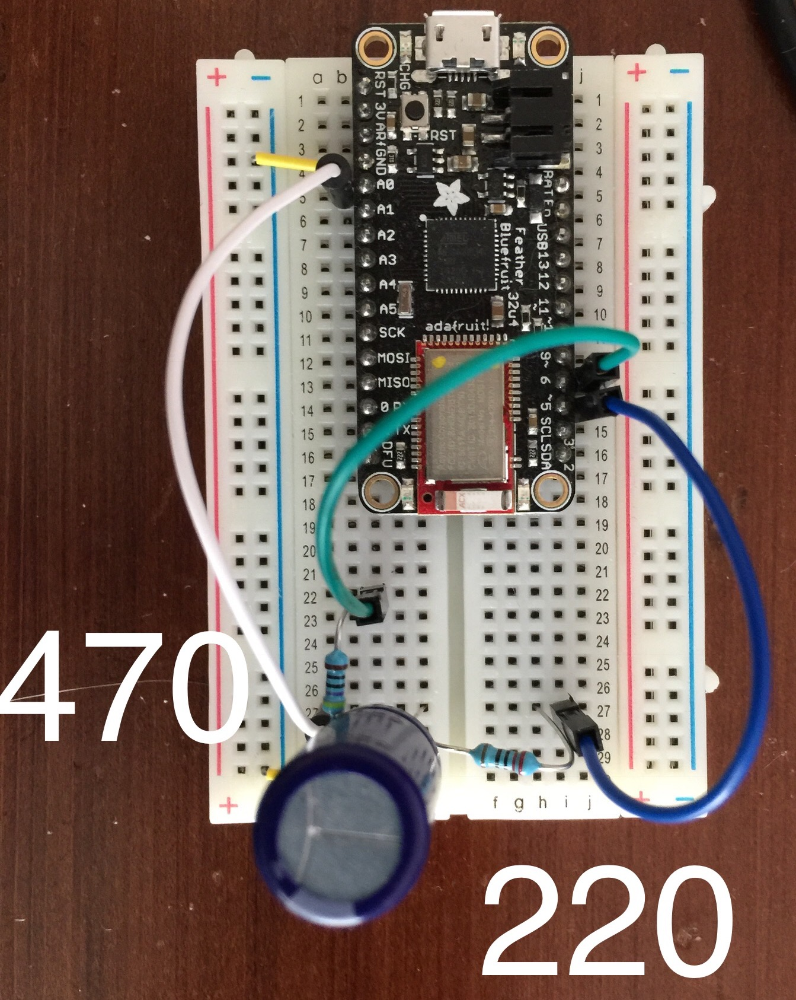
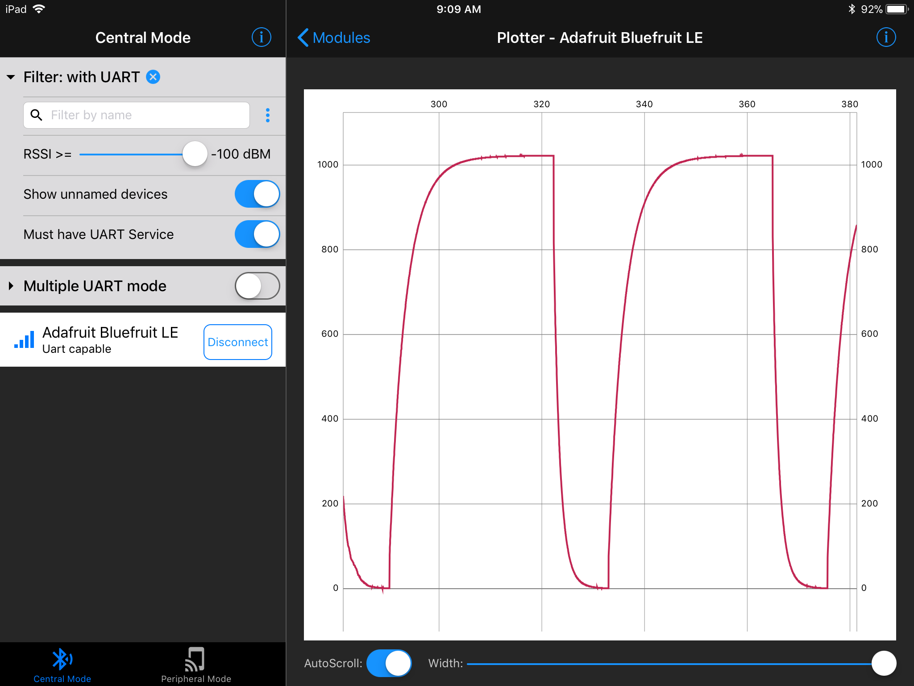

# Capacitance Meter

Based on https://www.arduino.cc/en/Tutorial/CapacitanceMeter

## Upload to Board

```
$ platformio run --target upload
```

## Serial Console

```
$ platformio device monitor
```

## Images



